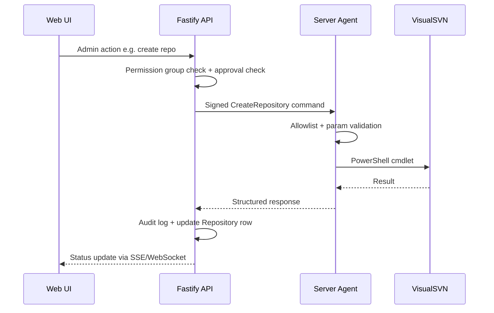

# Phase 3 — GMS SVN SERVER Agent

**Previous:** [Phase 2 — VisualSVN & Storage](./Phase_02_VisualSVN_Storage.md)  
**Next:** [Phase 4 — Repository Web UI](./Phase_04_Repository_Web_UI.md)  
**Duration:** 3–4 weeks  
**Runs on:** **GMS SVN SERVER**  
**Spec reference:** Command allowlist, repository creation, permission management, audit return flow

---

## Goal

Secure bridge between Fastify API and VisualSVN — **no direct shell execution from web backend**.

---

## Deliverables

### Agent (`apps/agent` — .NET Windows Service)

- Windows Service installer (MSI or scripted install)
- HTTPS listener on private network; mutual TLS or HMAC-signed request validation
- **Command allowlist:**
  - `CreateRepository` — VisualSVN PowerShell `New-SvnRepository`
  - `SetAccessRule` / `RemoveAccessRule` — path-level read/write/none
  - `GetRepositoryStatus` — size, HEAD revision, lock summary
  - `ExecuteBackup` — approved backup script invocation
  - `InstallHook` — pre-commit/post-commit hook deployment
  - `ListRepositories` — sync inventory
- Parameter validation (repo name regex, path traversal prevention, max path depth)
- Structured result: `{ success, stdout, stderr, exitCode, durationMs, commandId }`
- Local agent audit log forwarded to backend

### Backend (`apps/api`)

- Agent client: sign requests, retry with idempotency keys
- `AgentCommand` table: pending/running/completed/failed
- Command orchestration with approval gate hook (stub until Phase 4)
- Repository sync job (BullMQ): reconcile DB metadata with agent inventory
- SSE/WebSocket for command completion → update Repository status + audit log

### Contracts (`packages/svn-contracts`)

- Shared JSON schemas for commands and responses (TypeScript + C#)

---

## Implementation status (code)

| Deliverable | Status |
|-------------|--------|
| `packages/svn-contracts` — payloads, HMAC signing | Done |
| `AgentCommand` table + orchestration | Done |
| Agent client (signed requests, mock mode) | Done |
| `POST /repositories` → CreateRepository flow | Done |
| SSE `/agent/events` for command completion | Done |
| BullMQ hourly repo sync (requires Redis) | Done |
| `apps/agent` .NET 8 Windows Service | Done (source; requires .NET SDK to build) |
| SetAccessRule end-to-end on VisualSVN | Stub in agent (mock + Phase 4 UI) |
| MSI installer | Script: `apps/agent/scripts/install-service.ps1` |

---

## Agent Command Flow

---

## Acceptance Criteria

- [ ] Backend cannot execute arbitrary shell commands
- [ ] CreateRepository end-to-end: DB `pending` → agent creates → DB `active`
- [ ] SetAccessRule applies VisualSVN path permission matching permission group decisions
- [ ] Every agent invocation logged with correlation ID
- [ ] Agent rejects unsigned/invalid requests
- [ ] Service survives reboot; auto-starts

---

## Dependencies

- [Phase 2](./Phase_02_VisualSVN_Storage.md) VisualSVN operational
- [Phase 1](./Phase_01_Core_Web_Platform.md) Repository model and audit service
- Network connectivity: Docker web stack ↔ Windows SVN server (firewall rules)

---

## Risks / Mitigations

| Risk | Mitigation |
|------|------------|
| Direct backend shell access | Code review gate: no `exec`/`spawn` outside agent client module |
| Permission drift | One-way push in Phase 3; reconciliation report in Phase 4 |

---

## Team Focus

| Role | Focus |
|------|-------|
| Windows/C# dev | .NET agent service, allowlist, installer |
| Backend dev | Agent client, AgentCommand table, BullMQ sync |
| Security | HMAC/mTLS, parameter validation review |
