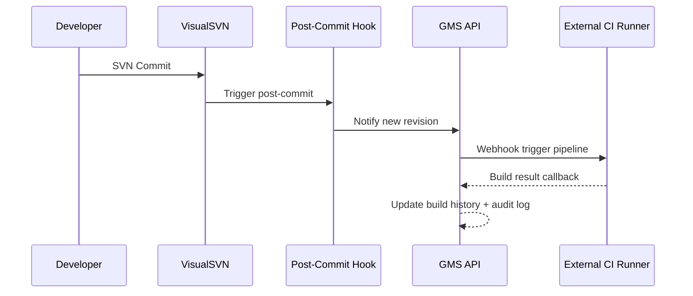

# Phase 9 — Build Automation (Optional)

**Previous:** [Phase 8 — Collaboration](./Phase_08_Collaboration.md)  
**Next:** —  
**Duration:** 2–4 weeks (scope dependent)  
**Spec reference:** SVN post-commit build/test pipeline integration if required

---

## Goal

Post-commit hook driven build/test pipeline integration for SVN workflows.

**Note:** Document marks this as "if required" — treat as optional MVP+ unless GMS confirms mandatory for launch.

---

## Deliverables

### Hook Integration (extends Phase 3 `InstallHook`)

- Post-commit hook template: notify GMS API of new revision
- BullMQ job triggers configured pipeline runner (webhook to Jenkins/Azure DevOps/internal runner — **not Git-native CI**)

### Build Automation UI (Admin)

- Per-repo pipeline config: trigger branches/paths, webhook URL, secret
- Build history table: revision, status, duration, log link
- Optional: status badge on repo dashboard

### Audit

- Pipeline trigger events in audit log

---

## Hook Flow

---

## Acceptance Criteria

- [ ] Commit to configured branch triggers exactly one pipeline invocation
- [ ] Build result visible on repo page within 2 min of commit
- [ ] Failed webhook does not block SVN commit (hook is async/non-blocking)
- [ ] Pipeline trigger events appear in audit log

---

## Dependencies

- [Phase 3](./Phase_03_Server_Agent.md) hook management (`InstallHook`)
- External CI/runner endpoint (customer-provided: Jenkins, Azure DevOps, etc.)

---

## Risks / Mitigations

| Risk | Mitigation |
|------|------------|
| Hook blocks commit | Async/non-blocking hook design |
| CI endpoint unavailable | Queue retry; do not fail commit |
| Git-native CI expectations | Document SVN-specific webhook integration |

---

## Team Focus

| Role | Focus |
|------|-------|
| Backend dev | Hook template, webhook dispatcher, build history API |
| Frontend dev | Pipeline config UI, build status badge |
| DevOps | CI runner integration, webhook secrets |
