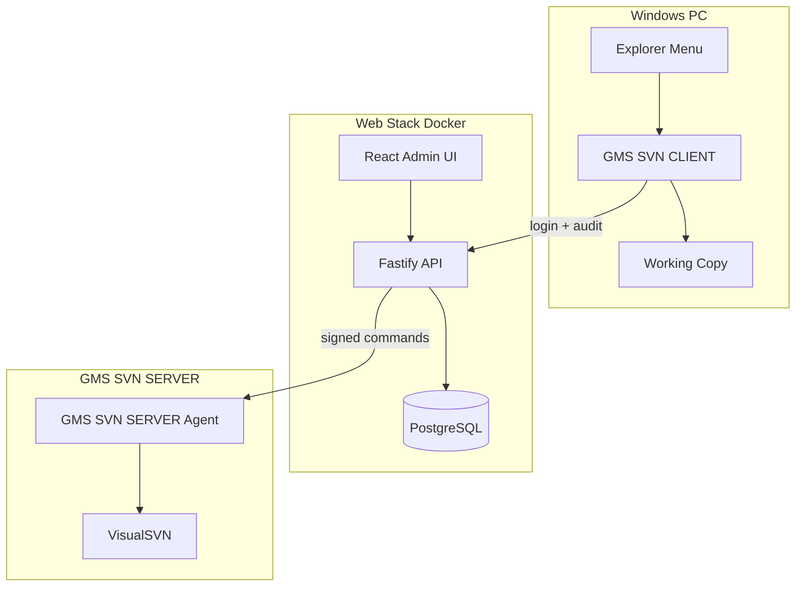

# GMS SVN Platform — Phase-Wise Plans (Index)

**Document type:** Planning only (no implementation)  
**Source:** [GMS_SVN_Platform_Detailed_Project_Document.docx](../../GMS_SVN_Platform_Detailed_Project_Document.docx)  
**Approach:** **Simple SVN-like** — VisualSVN + web admin + Windows client. No Git. No Gitea extras.

---

## Product Statement

**GMS SVN Platform = GMS SVN Web Admin + GMS SVN SERVER + GMS SVN CLIENT + Storage**

| Component | Name |
|-----------|------|
| Server | **GMS SVN SERVER** (VisualSVN + repos + server agent) |
| Client | **GMS SVN CLIENT** (Windows desktop app) |
| Web admin | **GMS SVN Web Admin** (browser UI + API) |

| Decision | Choice |
|----------|--------|
| Server name | **GMS SVN SERVER** |
| Client name | **GMS SVN CLIENT** |
| Deployment | Hybrid — Web Admin in Docker + GMS SVN SERVER on Windows |
| User model | `User`, `Group`, `GroupMember` only |
| Permissions | Repo/path read-write-none on users and groups (VisualSVN style) |

**Out of scope:** Git, multi-tenant, roles, departments, approval workflows, issues, wiki, Kanban, OpenSearch (initially).

---

## Phase Plans

| Phase | Document | Duration | Summary |
|-------|----------|----------|---------|
| 0 | [Phase_00_Foundation.md](./Phase_00_Foundation.md) | 1–2 weeks | Monorepo, Docker, CI |
| 1 | [Phase_01_Core_Web_Platform.md](./Phase_01_Core_Web_Platform.md) | 2–3 weeks | Users, groups, login, dashboard |
| 2 | [Phase_02_VisualSVN_Storage.md](./Phase_02_VisualSVN_Storage.md) | 2–3 weeks | VisualSVN, storage, backups |
| 3 | [Phase_03_Server_Agent.md](./Phase_03_Server_Agent.md) | 3–4 weeks | Agent, repo create, access rules |
| 4 | [Phase_04_Repository_Web_UI.md](./Phase_04_Repository_Web_UI.md) | 3–4 weeks | Repos, path permissions, browse/log/diff |
| 5 | [Phase_05_Electron_Client.md](./Phase_05_Electron_Client.md) | 4–5 weeks | Checkout, Update, Commit, Diff, Log |
| 6 | [Phase_06_Explorer_Integration.md](./Phase_06_Explorer_Integration.md) | 2–3 weeks | Explorer right-click |
| 7 | [Phase_07_Reports_Audit_Search.md](./Phase_07_Reports_Audit_Search.md) | 2–3 weeks | Basic audit log + simple reports |
| 8 | [Phase_08_Collaboration.md](./Phase_08_Collaboration.md) | — | **Deferred** — not simple SVN |
| 9 | [Phase_09_Build_Automation.md](./Phase_09_Build_Automation.md) | — | **Optional** — post-commit hooks |

---

## Simple Architecture



---

## Data Model (all phases)

```
User (isAdmin flag for web console)
Group
GroupMember
Repository
RepoAccessRule (repo + path + user OR group + read/write/none)  ← Phase 4
AuditLog
```

---

## Critical Path

**0 → 1 → 2 → 3 → 4 → 5 → 6** = complete simple SVN platform (~5–6 months)

Phases 7–9 are optional add-ons.

---

## Timeline (Simple SVN)

| Phase | Duration | Cumulative |
|-------|----------|------------|
| 0 | 1–2 weeks | 2 weeks |
| 1 | 2–3 weeks | 5 weeks |
| 2 | 2–3 weeks | 8 weeks |
| 3 | 3–4 weeks | 12 weeks |
| 4 | 3–4 weeks | 16 weeks |
| 5 | 4–5 weeks | 21 weeks |
| 6 | 2–3 weeks | 24 weeks |
| 7 | 2–3 weeks | optional |
| 8 | deferred | — |
| 9 | optional | — |

**MVP launch:** End of Phase 6 (~6 months)

---

## MVP = Core SVN Only

| Feature | Phase |
|---------|-------|
| Users, groups, members | 1 |
| Create repo, path permissions | 4 |
| Browse, log, diff in web | 4 |
| Checkout, Update, Commit, Diff, Log | 5 |
| Explorer right-click | 6 |
| Basic audit + export | 7 (optional) |
